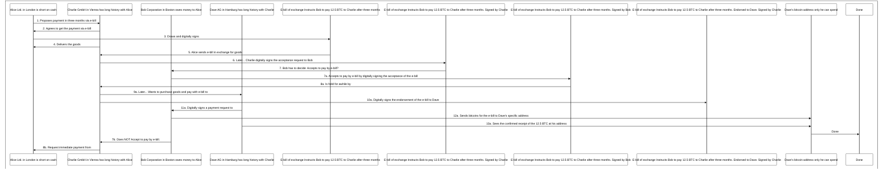

# E-bill The Sequence Diagram

```mermaid
%%{
  init: {
    'theme': 'base',
    'themeVariables': {
        'primaryColor': '#FFFFFF',
        'primaryTextColor': '#000000',
        'primaryBorderColor': '#000000',
        'lineColor': '#000000',
        'secondaryColor': '#EEEEEE',
        'secondaryBorderColor': '#000000',
        'tertiaryColor': '#FFFFFF',
        'body': {
            'background': 'white'
        },
        'actor-line': {
            'stroke': 'green'
        }
    }
  }
}%%

sequenceDiagram
    box rgb(255, 255, 255)
    participant Alice Ltd. in London is short on cash
    participant Charlie GmbH in Vienna has long history with Alice
    participant Bob Corporation in Boston owes money to Alice
    participant Dave AG in Hamburg has long history with Charlie
    participant E-bill of exchange Instructs Bob to pay 12.5 BTC to Charlie after three months
    participant E-bill of exchange Instructs Bob to pay 12.5 BTC to Charlie after three months. Signed by Charlie
    participant E-bill of exchange Instructs Bob to pay 12.5 BTC to Charlie after three months. Signed by Bob
    participant E-bill of exchange Instructs Bob to pay 12.5 BTC to Charlie after three months. Endorsed to Dave. Signed by Charlie
    participant Dave's bitcoin address only he can spend
    participant Done
    end
    Alice Ltd. in London is short on cash->> Charlie GmbH in Vienna has long history with Alice: 1. Proposes payment in three months via e-bill
    Charlie GmbH in Vienna has long history with Alice->>  Alice Ltd. in London is short on cash: 2. Agrees to get the payment via e-bill
    Alice Ltd. in London is short on cash->> E-bill of exchange Instructs Bob to pay 12.5 BTC to Charlie after three months: 3. Draws and digitally signs
    Charlie GmbH in Vienna has long history with Alice->>  Alice Ltd. in London is short on cash: 4. Delivers the goods
    E-bill of exchange Instructs Bob to pay 12.5 BTC to Charlie after three months->> Charlie GmbH in Vienna has long history with Alice: 5. Alice sends e-bill in exchange for goods
    Charlie GmbH in Vienna has long history with Alice->> E-bill of exchange Instructs Bob to pay 12.5 BTC to Charlie after three months. Signed by Charlie: 6. Later... Charlie digitally signs the acceptance request to Bob
    E-bill of exchange Instructs Bob to pay 12.5 BTC to Charlie after three months. Signed by Charlie->> Bob Corporation in Boston owes money to Alice: 7. Bob has to decide: Accepts to pay by e-bill?
    Bob Corporation in Boston owes money to Alice->> E-bill of exchange Instructs Bob to pay 12.5 BTC to Charlie after three months. Signed by Bob: 7a. Accepts to pay by e-bill by digitally signing the acceptance of the e-bill
    E-bill of exchange Instructs Bob to pay 12.5 BTC to Charlie after three months. Signed by Bob->> Charlie GmbH in Vienna has long history with Alice: 8a. Is held for awhile by
    Charlie GmbH in Vienna has long history with Alice->> Dave AG in Hamburg has long history with Charlie: 9a. Later... Wants to purchase goods and pay with e-bill to
    Charlie GmbH in Vienna has long history with Alice->> E-bill of exchange Instructs Bob to pay 12.5 BTC to Charlie after three months. Endorsed to Dave. Signed by Charlie: 10a. Digitally signs the  endorsement of the e-bill to Dave
    Dave AG in Hamburg has long history with Charlie->> Bob Corporation in Boston owes money to Alice: 11a. Digitally signs a payment request to
    Bob Corporation in Boston owes money to Alice->> Dave's bitcoin address only he can spend: 12a. Sends bitcoins for the e-bill to Dave's specific address
    Dave AG in Hamburg has long history with Charlie->> Dave's bitcoin address only he can spend: 13a. Sees the confirmed receipt of the 12.5 BTC at his address
    Dave's bitcoin address only he can spend->> Done: Done
    Bob Corporation in Boston owes money to Alice->> Charlie GmbH in Vienna has long history with Alice: 7b. Does NOT Accept to pay by e-bill.
    Charlie GmbH in Vienna has long history with Alice->>  Alice Ltd. in London is short on cash: 8b. Request immediate payment from
```
